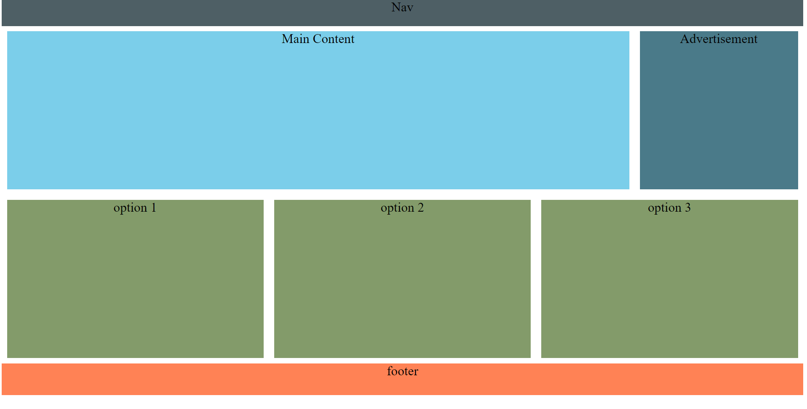

## Async Friday Activity October 18th, 2024

### Instructions 
Inside of your Unit 2 folder, create a new file called asyncActivity_Oct18.html.
Read the W3Schools article on CSS grid and the CSS grid container (Link provided below).
Once you have completed reading the articles, apply what you've learned try and recreate the 
layout below.
 
This assignment will be do by the end of class. 
You are permitted to work with other students.

***Remember to do your best!***

### Links to read 

[W3Schools CSS Grid Intro](https://www.w3schools.com/css/css_grid.asp)
 
[W3Schools CSS Grid Container](https://www.w3schools.com/css/css_grid_container.asp)

### Screenshot of what you need to create/ code

