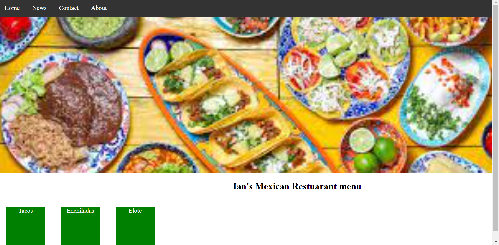

## Async Friday Activity September 27th

Inside of you unit 2 folder,create a html document and name the file asyncActivity_sept27.html.

Used what we've learned in class about html and css and try to emulate/ copy developing and designing this page.

Your website will be graded based on the following criteria:

- Did you name your document courrectly?
- Did you put your assignment in the correct unit folder?
- Does your page feature a navbar?
- Does your page feature a landing image?
- Does your page feature a menu of food items with prices?

### Once complete, make sure to publish your work to github.

### This assignment is due at the end of class
